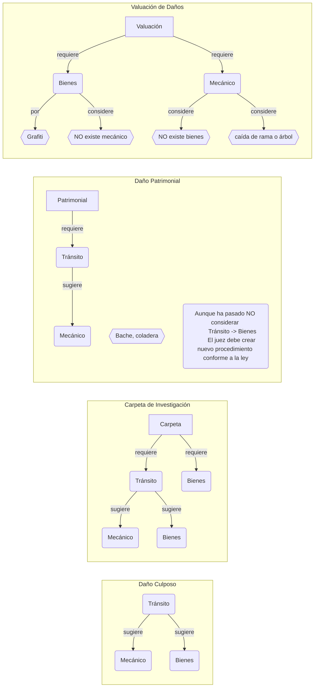

## Procedimiento

Datos a tomar para el tipo de procedimiento:
|               |__Daño__|__Carpeta__|__Patrimonial__|__Valuación__||
|-|-|-|-|-|-|
|_Generales_    |✔️     |✔️         |✔️             |✔️          ||
|_Lugar_        |✔️     |✔️         |✔️             |✔️          ||
|_Obj Bienes_   |Puede  |Puede       |❌             |Solo bienes  ||
|_Vehículo Inv_ |>=1    |>=1         |1              |Solo mecánico||
|_Involucr SinV_|Puede  |Puede       |❌             |Solo bienes  ||
|_Llamados_     |✔️     |✔️         |✔️             |✔️          ||
|||||||

✔️ Necesario
❌ NO debe 

_Daño culposo_, _Carpeta de Investigación_ y _Daño Patrimonial_ son __Procedimientos__ ocasionados por el tránsito de vehículos (en circulación).

En todos los casos de _procedimiento con intervención_ se puede anexar otra intervención por __ampliación de dictamen__.

Las _Carpetas de investigación_ pueden contar con un dictamen concluyente de tránsito emitido por la fiscalía, y solo requerir la valuación de bienes dañados por el hecho de tránsito.

En las solicitudes de valuación de daños existen varias posibilidades al no existir un __Procedimiento__ normado (legalmente).
- Valuación por grafiti
- Valuación por caida de rama o arbol al circular el vehiculo (_en discusión_)

## Flujo de intervenciones PTT para los procedimientos

## Vehiculos asegurados
Un vehiculo tiene dos campos (< asegurado>, < insurancecompany_id>) con dos opciones para indicar el seguro.
  - Cuenta con seguro. (true , '< nombreCompañia>') no puede ser (true, null)
  - Sin seguro. (false, null) no puede ser (false, '< vacio> o < nombreCompañia>')
        podria ser (false, 'Sin seguro') pero hay que modificar los valores de la tabla de seguros inutilizando el campo < asegurado>, si no se selecciona opción queda (false, null)

