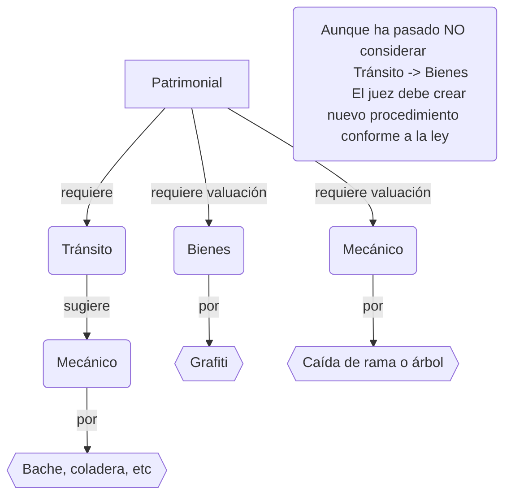

# Discusión

## Consideraciones para el diseño

Las intervenciones siempre derivan de los procedimientos.

Todas las solicitudes de intervención deben registrar la fecha y hora en que se recibe el llamado en la coordinación. Y asignar un horario para la intervención.

La intervención de daño patrimonial la ley solo contempla el procedimiento por daño ocasionado por bache, dejando fuera cualquier otro elemento o desperfecto que altere la circulación en la vía como las coladeras abiertas, hoyos o sacavones. Pero para efectos practicos en el sistema tambien se consideran dentro de este procedimiento.

La caida de rama o árbol ha estado en discusión si el vehiculo circulaba o se encontraba estacionado corresponde a un hecho de tránsito. Si se debe atender. Solo amerita valuación realizada por el Mecánico o debe incluir intervención de tránsito. Por lo que se considera que puede solicitarse solo la valuación del daño o realizar todo el procedimiento de intervención de tránsito y posible valuación mecánica.

## Propuesta de cambio de logica de negocio

Para unificar las intervenciones en el "procedimiento virtual" de _daño patrimonial_.

- Carpeta y Daño culposo quedan igual.
- Considerar en el registro de __Procedimiento__ si se puede unificar _'Patrimonial'_ y _'Valuación'_. Porque _'Valuación'_ solo considera solicitudes de intervenciones por grafitti o caida de rama o árbol, que pueden considerarse tambien como daños patrimoniales, aunque NO necesariamente originados por tránsito de vehiculos.

Datos a tomar para el tipo de procedimiento:
|               ||__Patrimonial__   |||
|-|-|-|-|-|
|_Generales_    ||✔️                |||
|_Lugar_        ||✔️                |||
|_Obj Bienes_   ||Solo bienes        |||
|_Vehículo Inv_ ||Solo Tránsito y Mecánico|||
|_Involucr SinV_||Solo bienes        |||
|_Llamados_     ||✔️                |||
|||||||
✔️ Necesario

